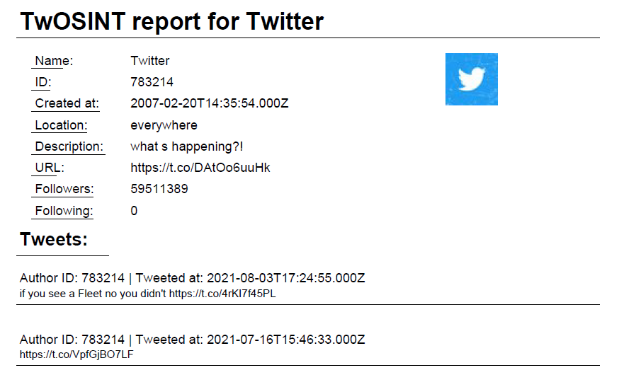

# TwOSINT - A Python Twitter OSINT tool

**Note:** _This tool is not meant any serious use, as it uses the Twitter API requiring the user to provide their **Bearer Token**._<br/>

TwOSINT is a Twitter OSINT tool created with Python. It obtains the profile information and up to 3200 tweets from a target Twitter user.
The obtained information is then saved in one of the three provided formats. These being:
* CSV (profile and tweets saved to two separate files)
* JSON (saves the largest amount of info)
* PDF (Looks kinda nice)

What is saved from the data provided by Twitter's API is different for all of the three formats.
However, to get the most bang for your buck, use the JSON format.

### Acknowledgement
I would like to thank [Jaskaskaskas](https://github.com/Jaskaskaskas) for participating in the creation of an earlier iteration of TwOSINT.

### Getting Started
In order for TwOSINT to work, you must provide it with you Twitter API bearer token.
The token can be obtained from [Twitter's Developer Platform](https://developer.twitter.com/en/docs/twitter-api/getting-started/getting-access-to-the-twitter-api),
just select the **_"Apply for the Standard product track"_**.

Once you have your token, run the following commands:
```bash
$ git clone https://github.com/Zabrakk/TwOSINT.git
$ cd TwOSINT
$ pip3 install -r requirements.txt
```

At this point you should be ready to use TwOSINT. To ensure that everything is working, run, e.g., the following command:
```bash
$ python3 TwOSINT.py twitter -n 5 -t <your_bearer_token>
```

### Command Line Arguments
TwOSINT includes the following command line arguments:
```
usage: TwOSINT.py [-h] [-t] [--no-save-token] [-f] [-o] [-n] [--no-retweets] [--no-replies] [--start-time] [--end-time] target

positional arguments:
  target           Twitter @handle of the target

optional arguments:
  -h, --help       show this help message and exit
  -t , --token     Twitter API bearer token
  --no-save-token  Stop TwOSINT from saving your API bearer token to bearer_token.txt
  -f , --format    Output format of the report. defaults to json
  -o , --output    Output file name, file extension doesn't need to be provided. Defaults to target's Twitter handle
  -n               Number (5-3200) of tweets to fetch. Defaults to 100
  --no-retweets    Exclude retweets
  --no-replies     Exclude replies
  --start-time     Obtain tweets posted after this time. Format is "YYYY-mm-ddThh:mm:ssZ"
  --end-time       Obtain tweets posted before this time. Format is "YYYY-mm-ddThh:mm:ssZ"
```
**Note:** _If you don't want TwOSINT to save your barer token to bearer_token.txt, use **--no-save-token**_

### Providing the API Bearer Token
The API bearer token can be provided with any of the following ways:

Command line argument:
```bash
$ python3 TwOSINT.py -t <your_bearer_token>
$ python3 TwOSINT.py --token <your_bearer_token> # Alternative way
```
Environment variable:
```bash
$ export BEARER_TOKEN=<your_bearer_token>    # Linux
$ set BEARER_TOKEN=<your_bearer_token>       # Windows
```
bearer_token.txt file:
```
$ touch bearer_token.txt
bearer_token=<your_bearer_token> # Add this in the file
```
Or finally, through input when prompted to enter it.
```bash
$ python3 TwOSINT.py twitter
Enter your Bearer Token:
```

### Save Formats
As stated previously, TwOSINT supports saving to CSV, JSON and PDF files.

Saving to CSV generates two different files, i.e., **<filename>_profile.csv** and **<filename>_tweets.csv**.<br/>
*_profile.csv is formatted as follows:
```
Handle:,<Targets profile handle>
Name:,<Name displayed on target's profile>
ID:,<Target's Twitter ID>
Description:,<Targets profiel description>
Profile img:,<URL to profile image>
Verified:,<True|False>
Followers:,<number of user following the target>
Following:,<number of user followed by targets>
```
While *_tweets.csv is formatted like this:
```
Tweeted at,Text,Retweets,Replies,Coordinates
<tweet1>
<tweet2>
...
```

The most information is stored when using the JSON format. 
The files are quite long. Thus, an example can be found [here](examples/twitter.json)

Finally, for the option that is at least somewhat pleasing to the eyes, PDF.
The image below illustrates what an example PDF report looks like:



### Running Tests
Tests can be ran with the command:
```bash
$ python3 -m pytest test
```
