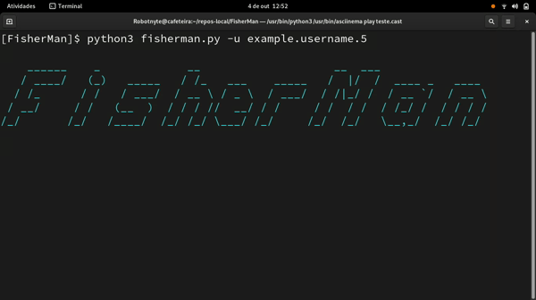

# FisherMan

[](https://github.com/Godofcoffe/FisherMan/blob/main/LICENSE)


### Search for public profile information on Facebook



## Installation

```console
# clone the repo
$ git clone https://github.com/Godofcoffe/FisherMan

# change the working directory to FisherMan
$ cd FisherMan

# install the requeriments
$ python3 -m pip install -r requeriments.txt

# dependency:
 you need to install geckodriver on your machine,
 download the binary from the official mozilla repo:
 https://github.com/mozilla/geckodriver/releases/latest
 extract and copy the binary, i recommend placing it in /usr/bin
```

## Docker

### Build

```console
docker build . -t fisherman
```

### run
```console
docker run --rm -it fisherman --help
```

## Usage

```console
$ python3 fisherman.py --help
usage: fisherman.py [-h] [--version] [-u USERNAME [USERNAME ...] | -i ID
                    [ID ...] | --use-txt TXT_FILE | -S USER] [--update]
                    [-v | -q] [-sf]
                    [--specify {0,1,2,3,4,5} [{0,1,2,3,4,5} ...]] [-s]
                    [--filters]
                    [-work WORK | -education EDUCATION | -city CITY] [-b]
                    [--email EMAIL] [--password PASSWORD] [-o | -c]

FisherMan: Extract information from facebook profiles. (Version 3.7.1)

optional arguments:
  -h, --help            show this help message and exit
  --version             Shows the current version of the program.
  -u USERNAME [USERNAME ...], --username USERNAME [USERNAME ...]
                        Defines one or more users for the search.
  -i ID [ID ...], --id ID [ID ...]
                        Set the profile identification number.
  --use-txt TXT_FILE    Replaces the USERNAME parameter with a user list in a
                        txt.
  -S USER, --search USER
                        It does a shallow search for the username. Replace the
                        spaces with '.'(period).
  --update              Check for changes with the remote repository to
                        update.
  -v, --verbose         It shows in detail the data search process.
  -q, --quiet           Eliminates and simplifies some script outputs for a
                        simpler and more discrete visualization.
  -b, --browser         Opens the browser/bot.

search options:
  --filters             Shows the list of available filters.
  -work WORK            Sets the work filter.
  -education EDUCATION  Sets the education filter.
  -city CITY            Sets the city filter.

profile options:
  -sf, --scrape-family  If this parameter is passed, the information from
                        family members will be scraped if available.
  --specify {0,1,2,3,4,5} [{0,1,2,3,4,5} ...]
                        Use the index number to return a specific part of the
                        page. about: 0, about_contact_and_basic_info: 1,
                        about_family_and_relationships: 2, about_details: 3,
                        about_work_and_education: 4, about_places: 5.
  -s, --several         Returns extra data like profile picture, number of
                        followers and friends.

credentials:
  --email EMAIL         If the profile is blocked, you can define your
                        account, however you have the search user in your
                        friends list.
  --password PASSWORD   Set the password for your facebook account, this
                        parameter has to be used with --email.

output:
  -o, --file-output     Save the output data to a .txt file.
  -c, --compact         Save the output data to a .txt file and compress.
```

To search for a user:

* User name: `python3 fisherman.py -u name name.profile name.profile2`
* ID: `python3 fisherman.py -i 000000000000`

The username must be found on the facebook profile link, such as:

```
https://facebook.com/name.profile/
```

It is also possible to load multiple usernames from a .txt file, this can be useful for a brute force output type:

```
python3 fisherman.py --use-txt filename.txt
```

Some profiles are limited to displaying your information for any account, so you can use your account to extract. Note:
this should be used as the last hypothesis, and the target profile must be on your friends list:

```
python3 fisherman.py --email youremail@email.com --password yourpass
```

### Some situations:

* For complete massive scrape:
  ```
  python3 fisherman.py --use-txt file -c -sf
  ```
  With a file with dozens of names on each line, you can make a complete "scan" taking your information and even your
  family members and will be compressed into a .zip at the output.


* For specific parts of the account:
    * Basic data: `python3 fisherman.py -u name --specify 0`
    * Family and relationship: `python3 -u name --specify 2`
    * It is still possible to mix: `python3 fisherman.py -u name --specify 0 2`


* To get additional things like profile picture, how many followers and how many friends:
  ```
  python3 fisherman.py -u name [-s | --several]
  ```
  
* For a short search by people's name:
  ```
  python3 fisherman.py [-S | --search] foo
  ```
  Replace the spaces in the name with "."(periods).
  The script returns around 30 profiles.

* To filter the search:
  ```
  python3 fisherman.py -S name -work fisherman
  ```
  If the filter has spaces, enclose it in quotes.
  
* For a minimalist execution:
  ```
  python3 fisherman.py [-q | --quiet]
  ```
  Considerably reduces the script's output texts and, by convention, improves performance.

## If you are using windows: [source](https://github.com/Godofcoffe/FisherMan/tree/compatible-with-windows)

## Contributing
I would love to have your help in developing this project.

Some things you can help me with:
  * Add more search filters.

Please look at the Wiki entry on [Adding filters to the search argument](https://github.com/Godofcoffe/FisherMan/wiki/Adding-filters-to-the-search-argument) to understand the issues.

## *This tool only extracts information that is public, not use for private or illegal purposes.*
_This is a legacy project, I have no guarantee that its functionality will be working in the future, because it does not apply some of Selenium's best practices._

## LICENSE

BSD 3-Clause © FisherMan Project

Original Creator - [Godofcoffe](https://github.com/Godofcoffe)

# twosint - v 2.0.4 Release


# official blog post

-> https://falkensmaze.medium.com/how-to-conduct-a-twitter-osint-investigation-like-a-pro-d04831478f1a


# INTRODUCTION 

Hello everybody, I go by the name c0m3t-k2 or falkensmaze.

I have created this tool for beginners, to automate the process of twint.

- This python tool uses the twint library to automate the Twitter OSiNT Investigation steps.

- You just have to fill up the required information and select your chosen investigation and it's done!

- I will update this tool whenever new ideas pop in my head so let me know if you find any bugs or if you can help me improve the tool!

# UPDATE :
 
  - 'Till now the tool was very automated, you only needed to put in the username and select the option
  - Right now though, it is much more interesting. 
  - You can use the tool like a terminal cmd-line interface.
  - If you get stuck, type in 'help'
  - And for all of the script kiddies out there that want everything automated, don't worry , I re-coded an automation file "automation.py"

# twint INSTALLATION :

  - git clone --depth=1 https://github.com/twintproject/twint.git
  - cd twint
  - pip3 install . -r requirements.txt

# twosint INSTALLATION :
  - git clone https://github.com/c0m3t-k2/tw1tter0s1nt.git
  - cd tw1tter0s1nt
  - pip install -r requirements.txt / pip3 install -r requirements.txt
  - chmod +x twosint.py
  - python3 twosint.py
 
  Windows 
  - pip3 install --user --upgrade -e git+https://github.com/twintproject/twint.git@origin/master#egg=twint
  - git clone https://github.com/c0m3t-k2/tw1tter0s1nt.git
  - cd [tw1tter0s1nt directory]
  - python twosint.py / python3 twosint.py
If the requirements file doesn't work, type in : pip3 install twint

# windows support

- currently, me and the users of twosint have discorverd heavy bugs while using the framework on Windows
- because of that, I have currently ended Windows support, however I am still working on it.
- I will try to find a way to get it working on Windows but for now me and my friends have not found a way to get it working!
- we recommend either using a VM or a cloud console.
- Linux users, do not worry , Linux is 100% supported and it is the platform the framework is mainained on.
 
# WHO IS THIS TOOL FOR? : 
  - Penetration testers/Ethical hackers
  - IT students that are looking for something cool to search for.
  - OSiNT investigators (This tool is a MUST for you! It makes the job much more faster and efficient!)
  - Journalists who are looking for more information on a specific celebrity or person

 Some things to note:
 - You NEED the python library twint. Installation guide right here : https://github.com/twintproject/twint
 - The author of the tool is not responsible in any way for one's misactions using tw1tter0s1nt.
 - Please keep in mind that this is a tool made by only a person and so it is hard to keep up with all the bugs and issues.
 - Still, if you find any bugs, report them in the issues section!

# TESTED ENVIRONMENTS:
 - Kali Linux ==> Fully supported
 - Pop!_OS ==> Fully supported
 - Windows 10/11 ===> Support ended on 7/20/2021


# Automation Script Announcement
 - I put a lot of hard work into developing and maintaining the original twosint.py script . 
 - The automation script usually for script kiddies is a better copy of the old automated tw1tter0sn1t.py file
 - It is completely usable however , I wanted to announce this :
      - Maintenance updates will be applied once every month!
      - Module updates will be applied 2 weeks after the twosint.py BETA update
      - Aesthetic (if any) will be applied 4 weeks after twosint.py will be updated
      - Security updates will still be initiated right after I or someone else discovers a hole in the script (I want my users to have a secure OSiNT investigation)
 - What I am trying to do is create a Twitter OSiNT framework!
 - The tool will still automate a lot of subprocesses that you will have to go through if you would do it without the script.
 - Using the automation.py script is not wrong , however, in some time I will probably end its updates!
 - If the tool will get attention and if you want to contribute to it, you can absolutely implement the new features from the twosint-framework to the automation file.
 - The problem is that I do NOT have enough time to update the automation software fast.
# Basic usage:


Anyone can contribute to this tool , but don't steal code nerd!

CURRENT VERSION --> twosint 2.0.4

Thanks, c0m3t-k2!